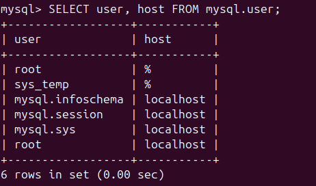

# Домашнее задание к занятию «Работа с данными (DDL/DML)» Соколов Тимофей

### Инструкция по выполнению домашнего задания

1. Сделайте fork [репозитория c шаблоном решения](https://github.com/netology-code/sys-pattern-homework) к себе в Github и переименуйте его по названию или номеру занятия, например, https://github.com/имя-вашего-репозитория/gitlab-hw или https://github.com/имя-вашего-репозитория/8-03-hw).
2. Выполните клонирование этого репозитория к себе на ПК с помощью команды `git clone`.
3. Выполните домашнее задание и заполните у себя локально этот файл README.md:
   - впишите вверху название занятия и ваши фамилию и имя;
   - в каждом задании добавьте решение в требуемом виде: текст/код/скриншоты/ссылка;
   - для корректного добавления скриншотов воспользуйтесь инструкцией [«Как вставить скриншот в шаблон с решением»](https://github.com/netology-code/sys-pattern-homework/blob/main/screen-instruction.md);
   - при оформлении используйте возможности языка разметки md. Коротко об этом можно посмотреть в [инструкции по MarkDown](https://github.com/netology-code/sys-pattern-homework/blob/main/md-instruction.md).
4. После завершения работы над домашним заданием сделайте коммит (`git commit -m "comment"`) и отправьте его на Github (`git push origin`).
5. Для проверки домашнего задания преподавателем в личном кабинете прикрепите и отправьте ссылку на решение в виде md-файла в вашем Github.
6. Любые вопросы задавайте в чате учебной группы и/или в разделе «Вопросы по заданию» в личном кабинете.

Желаем успехов в выполнении домашнего задания.

---

Задание можно выполнить как в любом IDE, так и в командной строке.

### Задание 1
1.1. Поднимите чистый инстанс MySQL версии 8.0+. Можно использовать локальный сервер или контейнер Docker.

1.2. Создайте учётную запись sys_temp. 

1.3. Выполните запрос на получение списка пользователей в базе данных. (скриншот)



1.4. Дайте все права для пользователя sys_temp. 

1.5. Выполните запрос на получение списка прав для пользователя sys_temp. (скриншот)


1.6. Переподключитесь к базе данных от имени sys_temp.

Для смены типа аутентификации с sha2 используйте запрос: 
```sql
ALTER USER 'sys_test'@'localhost' IDENTIFIED WITH mysql_native_password BY 'password';
```
1.6. По ссылке https://downloads.mysql.com/docs/sakila-db.zip скачайте дамп базы данных.

1.7. Восстановите дамп в базу данных.

1.8. При работе в IDE сформируйте ER-диаграмму получившейся базы данных. При работе в командной строке используйте команду для получения всех таблиц базы данных. (скриншот)


*Результатом работы должны быть скриншоты обозначенных заданий, а также простыня со всеми запросами.*

1. Запустил контейнер: docker run --name mysql8 \
  -e MYSQL_ROOT_PASSWORD=rootpassword \
  -e MYSQL_DATABASE=sakila \
  -p 3306:3306 \
  -d mysql:8.0 \
  --default-authentication-plugin=mysql_native_password
2. Подключился к mysql: docker exec -it mysql8 mysql -uroot -prootpassword
3. Создал пользователя: CREATE USER 'sys_temp'@'%' IDENTIFIED BY 'password';
4. Проверил: SELECT user, host FROM mysql.user;
5. Выдал права: GRANT ALL PRIVILEGES ON *.* TO 'sys_temp'@'%';
FLUSH PRIVILEGES;
6. Проверил: SHOW GRANTS FOR 'sys_temp'@'%';
7. Изменил тип аутентификации: ALTER USER 'sys_temp'@'%' IDENTIFIED WITH mysql_native_password BY 'password';
8. Вышел: Exit
9. Скачал и распаковал дамп: wget https://downloads.mysql.com/docs/sakila-db.zip
unzip sakila-db.zip
10. Восстановил структуру: docker exec -i mysql8 mysql -uroot -prootpassword < sakila-db/sakila-schema.sql
11. Восстановил данные: docker exec -i mysql8 mysql -uroot -prootpassword < sakila-db/sakila-data.sql
12. docker exec -it mysql8 mysql -uroot -prootpassword
13. USE sakila;
SHOW TABLES;

Результаты на скриншотах к заданиям 1.3, 1.5 и 1.8


### Задание 2
Составьте таблицу, используя любой текстовый редактор или Excel, в которой должно быть два столбца: в первом должны быть названия таблиц восстановленной базы, во втором названия первичных ключей этих таблиц. Пример: (скриншот/текст)
```
Название таблицы | Название первичного ключа
customer         | customer_id
```

